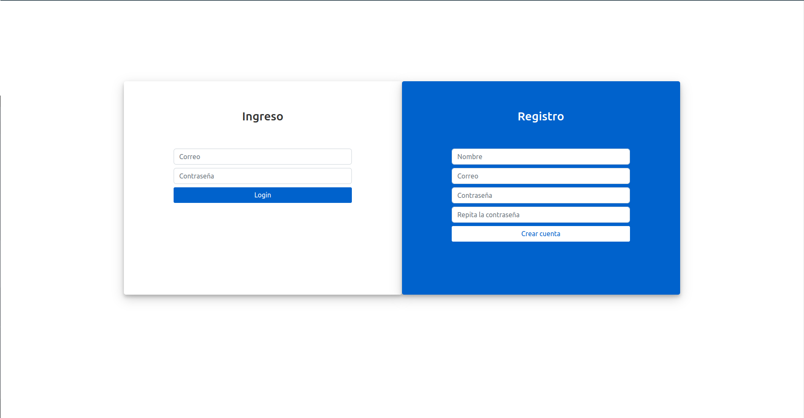
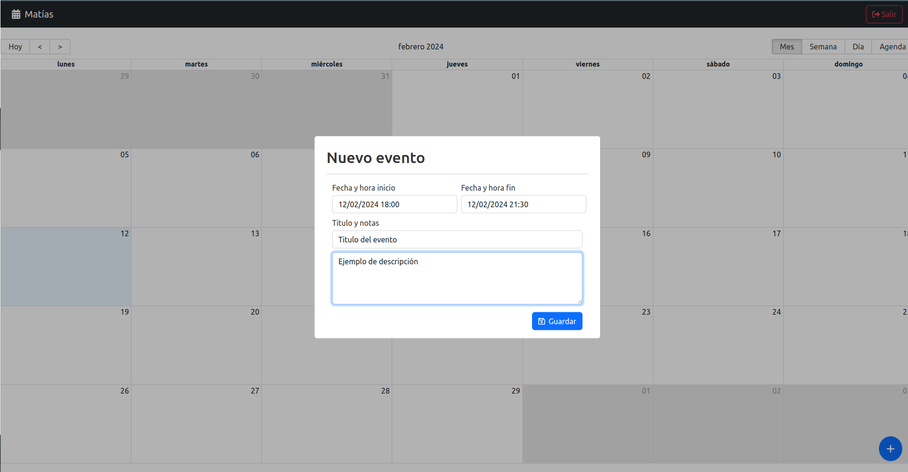
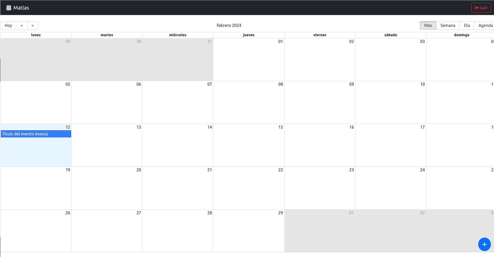
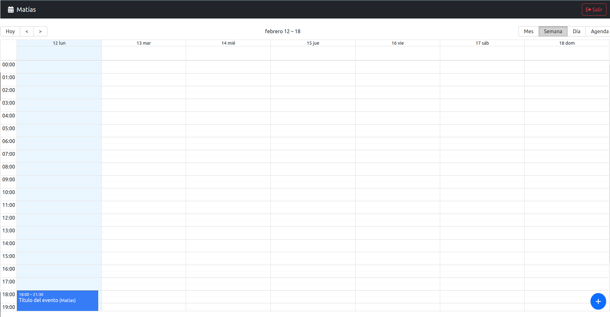
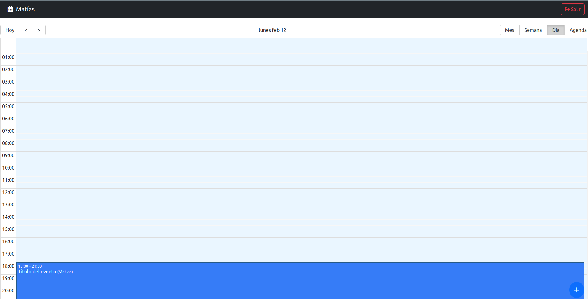
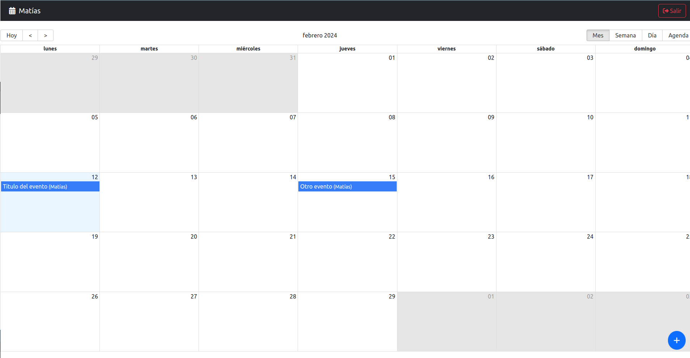
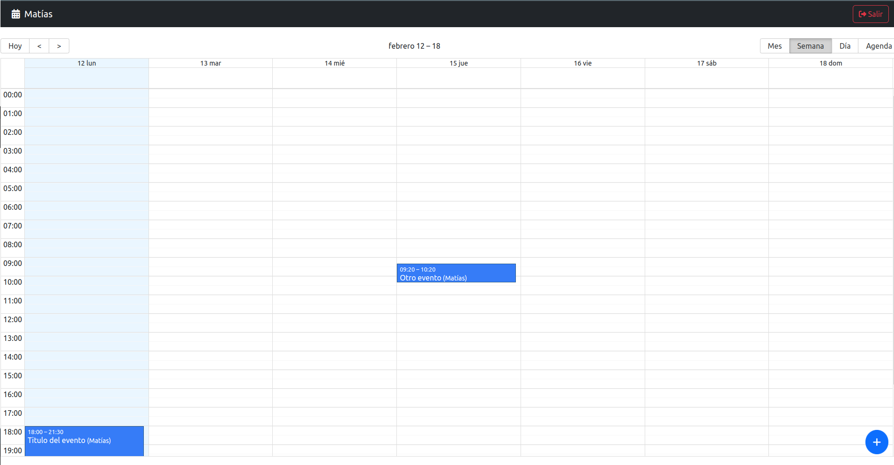
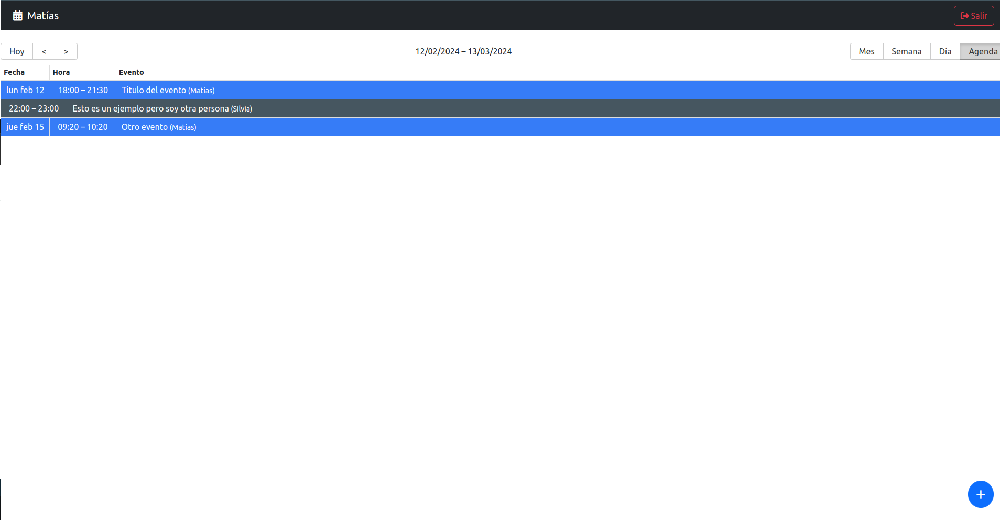

# MyJournal

CalendarPro is a versatile application designed to streamline event management for its users. With CalendarPro, registered users can effortlessly create and manage events at specific dates and times, all seamlessly reflected across various viewing options including monthly, weekly, daily, and agenda-style calendars. Powered by MongoDB for robust data storage, and employing NodeJS and Express for the server-side functionality, CalendarPro ensures smooth and efficient operations. On the frontend, React provides an intuitive and responsive user interface, enhancing the overall user experience. Developed with a focus on reinforcing Redux Toolkit concepts and mastering asynchronous request handling, CalendarPro offers a comprehensive learning experience while delivering practical utility.

## Features

- **User Registration and Authentication**: CalendarPro ensures secure access for users by implementing user registration and authentication functionalities.
- **Event Creation and Management**: Empowers users to effortlessly create, update, view, and delete events across various timeframes, including monthly, weekly, daily, and agenda views.
- **MongoDB Database Integration**: Utilizes MongoDB for robust data storage, ensuring efficient management of user-generated events.
- **NodeJS and Express Server**: CalendarPro operates on a NodeJS and Express server, providing a reliable backend infrastructure for seamless functionality.
- **Responsive Frontend with React**: Developed with React, CalendarPro offers an intuitive and responsive user interface, enhancing user experience across devices.
- **Redux Toolkit for State Management**: Implements Redux Toolkit for efficient state management, reinforcing core concepts while ensuring smooth interaction within the application.
- **Asynchronous Request Handling**: Enhances proficiency in asynchronous request handling by employing best practices in fetching and updating event data asynchronously.

## Installation

First of all, you need to download or clone the repository to your local machine. Then, you need to install the dependencies for both the frontend and the backend.

### Backend

1. Navigate to the `backend` directory.
2. Install dependencies using `npm install`.
3. Configure the environment variables in a `.env` file.
4. Run the application using `npm run dev`.

``` shell
PORT=
SECRET_JWT_SEED=
DB_CNN=
```

### Frontend

1. Navigate to the `frontend` directory.
2. Install dependencies using `npm install`.
3. Configure the environment variables in a `.env` file.
4. Run the application using `npm run dev`.

``` shell
VITE_API_URL=
```

## Contributions

Contributions to CalendarPro are welcome! If you'd like to contribute:

1. Fork the repository.
2. Create your feature branch (`git checkout -b feature/YourFeature`).
3. Commit your changes (`git commit -m 'Add some feature'`).
4. Push to the branch (`git push origin feature/YourFeature`).
5. Open a pull request.

## Images








